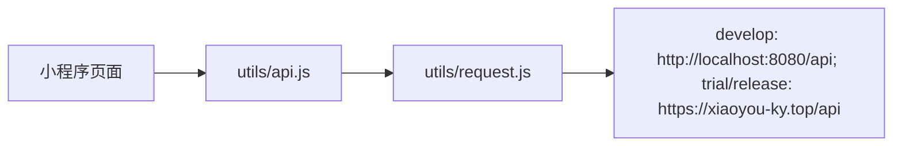
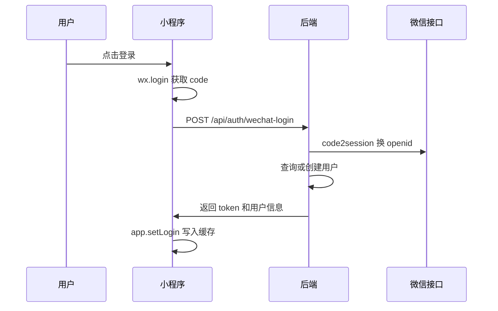

# 微信小程序说明

> 最后更新：2026-06-30

## 代码位置

小程序工程位于 `xiaochengxu`。

```text
xiaochengxu/
├── project.config.json
├── project.private.config.json
├── miniprogram/
│   ├── app.js
│   ├── app.json
│   ├── app.wxss
│   ├── pages/
│   ├── components/
│   ├── custom-tab-bar/
│   ├── utils/
│   └── images/
└── cloudfunctions/
    ├── api/
    └── quickstartFunctions/
```

## 当前主链路

当前小程序主链路通过 `miniprogram/utils/request.js` 直连 Spring Boot REST API。



`cloudfunctions/api` 中存在一套历史/可选云函数业务实现，包含 MySQL、JWT、AI 调用等重复逻辑。若后续继续采用直连 REST API，应考虑归档或删除云函数重复业务，避免双写维护。

## 全局配置

### `app.json`

注册页面：

- 首页：`pages/home/index`
- 主题：`pages/topics/index`
- 学习：`pages/learning/index`
- 我的：`pages/profile/index`
- 话题详情：`pages/topicDetail/index`
- 学习详情：`pages/learningTopic/index`
- AI 对话准备页：`pages/aiDialogSetup/index`
- AI 对话页：`pages/aiDialogChat/index`
- 单词本列表：`pages/wordBooks/index`
- 单词本详情：`pages/wordBookDetail/index`
- 单词练习：`pages/wordPractice/index`
- 单词详情：`pages/wordDetail/index`
- 每日外刊列表：`pages/dailyArticles/index`
- 每日外刊详情：`pages/dailyArticleDetail/index`
- 跟读精听列表：`pages/shadowingLessons/index`
- 跟读精听详情：`pages/shadowingLessonDetail/index`
- 口语热身主题列表：`pages/spokenWarmup/index`
- 口语热身详情：`pages/spokenWarmupDetail/index`
- 登录：`pages/login/index`
- 注册：`pages/register/index`
- 设置：`pages/settings/index`
- 会员开通：`pages/membership/index`
- 兑换：`pages/redeem/index`
- 日历：`pages/calendar/index`

底部 tab：

- 首页
- 主题
- 学习
- 我的

### `app.js`

全局状态：

- `token`
- `isLoggedIn`
- `role`
- `membershipActive`
- `membershipPermanent`
- `membershipExpireAt`
- `hasPassword`
- `userInfo`
- `baseUrl`

环境 API 地址：

- `develop` 配置为 `http://localhost:8080/api`，用于微信开发者工具本地联调后端。
- `trial`、`release` 配置为 `https://xiaoyou-ky.top/api`，用于体验版和正式版访问线上后端。
- 真机调试时，`localhost` 通常指手机或模拟器自身；如需连接电脑本机后端，应改为同一局域网内电脑 IP，例如 `http://192.168.x.x:8080/api`。
- 启动时通过 `wx.getAccountInfoSync()` 识别小程序环境并设置 `globalData.baseUrl`。

全局方法：

- `loadUserFromStorage()`：从本地缓存恢复登录态。
- `setLogin(token, userInfo)`：写入全局状态和本地缓存。
- `logout()`：清除登录态。
- `checkLogin()`：是否已登录。
- `isMember()`：管理员或会员。
- `isAdmin()`：是否管理员。

## 请求封装

### `utils/request.js`

统一封装 `wx.request`：

- 从 `app.globalData.baseUrl` 拼接请求地址。
- 自动附加 `Authorization: Bearer <token>`。
- 2xx 返回 `res.data`。
- 401 自动退出登录并跳转登录页。
- 403 仅作为权限不足返回调用页处理，不清除本地登录态；会员权限场景会引导到学习中心开通/兑换。
- 非 2xx 统一包装错误信息。

### `utils/api.js`

按业务封装接口方法：

- 认证：登录、注册、微信登录、改用户名、改密码、设置密码、PC 登录确认/取消。
- 话题：列表、详情、标签、统计、日历。
- 学习：主题详情、热身、词汇、表达、任务、点评。
- 口语热身：主题详情、热身介绍、核心词汇、句型模板、地道表达、模拟任务、AI 点评、真实语音转文字。
- 跟读精听：资源列表、详情、句级录音点评。
- 会员：会员状态、联系方式、卡密兑换。
- 会员支付：套餐列表、创建会员订单、查询订单状态并调用 `wx.requestPayment`；开发 mock 支付参数会走后端模拟支付确认，不直接传给微信支付 SDK。
- 单词练习：已发布单词本、单词本详情、下一词、单词详情、提交认识/模糊/不认识、进度。
- 每日外刊：未读/已读列表、外刊详情并自动标记已读。
- 用户提交话题：登录用户提交感兴趣的话题，管理员在 PC 后台处理。

## 页面说明

| 页面 | 文件 | 功能 |
| --- | --- | --- |
| 首页 | `pages/home/index` | 展示统计、最近主题、分类入口、学习入口 |
| 主题列表 | `pages/topics/index` | 标签筛选、关键词搜索、分页加载、跳转详情 |
| 话题详情 | `pages/topicDetail/index` | 展示主题、问题、会员学习入口 |
| 学习列表 | `pages/learning/index` | 会员学习入口、主题筛选、非会员开通提示 |
| 学习详情 | `pages/learningTopic/index` | AI 热身、词汇、表达、任务、回答点评 |
| AI 对话准备 | `pages/aiDialogSetup/index` | 登录用户选择教学/练习模式、初级/进阶难度、系统主题或自定义主题 |
| AI 对话 | `pages/aiDialogChat/index` | 当前页面内存中保持上下文，发送文字消息，播放 AI 音频，默认显示 AI 回复文字和教学点评，并支持手动隐藏文字 |
| 单词本列表 | `pages/wordBooks/index` | 作为换词书/词书选择页，按初级/进阶两块展示已发布单词本封面卡片、词数和个人进度 |
| 单词本详情 | `pages/wordBookDetail/index` | 单词练习总览页，展示当前词书所属等级、今日复习/新词计划、进度和开始练习入口 |
| 单词练习 | `pages/wordPractice/index` | 两段式练习：回忆态先展示英文单词和发音，主单词使用克制字号和中等加粗，用户选择认识/模糊/不认识；模糊和不认识进入答后展开态，使用蓝色词典卡样式展示释义、例句和句型；本轮结束后展示复盘和换词书入口 |
| 单词详情 | `pages/wordDetail/index` | 使用与练习页一致的蓝色词典卡详情样式，主单词使用较小字号和较轻字重，展示释义、音标、句型、例句、来源和发音入口 |
| 每日外刊列表 | `pages/dailyArticles/index` | 未读/已读 tab、封面卡片、下拉刷新、触底分页、跳转详情 |
| 每日外刊详情 | `pages/dailyArticleDetail/index` | 迷你播放器、逐段中英对照、总结、重点词汇、长难句解析和表达句型 |
| 跟读精听列表 | `pages/shadowingLessons/index` | 未学习/已学习 tab、游客可浏览资源卡片、登录用户按学习记录筛选 |
| 跟读精听详情 | `pages/shadowingLessonDetail/index` | 游客试看媒体和简介；登录用户查看完整连续学习流、逐句跟读、录音回放和 AI 点评 |
| 口语热身列表 | `pages/spokenWarmup/index` | 登录用户搜索、标签筛选、日期筛选系统主题并进入口语热身 |
| 口语热身详情 | `pages/spokenWarmupDetail/index` | 初级/进阶切换，按模块实时生成热身、词汇、句型、表达、任务，支持语音/文字回答和 AI 点评 |
| 提交话题 | `pages/topicSubmit/index` | 登录用户提交自己感兴趣的口语练习话题，成功后提示如被采纳会出现在主题库 |
| 登录 | `pages/login/index` | 微信登录，调用 `wx.login` 后传 code 到后端 |
| 注册 | `pages/register/index` | 用户名密码注册 |
| 我的 | `pages/profile/index` | 用户信息、会员状态、设置、兑换、PC 登录确认 |
| 设置 | `pages/settings/index` | 改用户名、改密码、微信用户首次设置密码、会员联系信息 |
| 会员开通 | `pages/membership/index` | 展示当前会员状态和上架套餐，创建微信支付订单并调起小程序支付 |
| 兑换 | `pages/redeem/index` | 卡密兑换与会员状态刷新 |
| 日历 | `pages/calendar/index` | 按月份查看话题日期分布 |

## 每日外刊流程

## 会员开通流程

小程序保留卡密兑换，并新增会员套餐购买：

1. 用户从“我的”页、会员拦截弹窗或其它会员入口进入 `pages/membership/index`。
2. 页面调用 `/api/membership/status` 和 `/api/membership/plans`。
3. 用户选择上架套餐后，小程序调用 `/api/membership/orders` 创建订单。
4. 后端返回 `wx.requestPayment` 所需参数。
5. 小程序调用 `wx.requestPayment`。
6. 支付成功后，小程序轮询 `/api/membership/orders/{orderNo}`，订单变为 `PAID` 后刷新会员状态。
7. 若后端返回 `mockPayment=true` 或 `prepay_id=mock_...`，小程序调用 `/api/dev/membership/orders/{orderNo}/mock-paid` 完成开发环境模拟支付，再按真实订单查询流程刷新会员状态。

注意：

- 小程序端不生成支付签名，不保存商户密钥。
- 支付成功后的最终开通结果以后端微信支付回调和订单查询为准。
- 真实 `wx.requestPayment` 失败时，页面会展示微信 SDK 返回的失败原因；用户取消支付展示“未完成支付”。
- `membershipPermanent` 用于展示永久会员；会员权限最终以后端动态判断为准。

小程序首页提供“每日外刊”入口；学习中心顶部不再展示独立入口卡片。

## 跟读精听展示规则

跟读精听列表页和详情页直接消费后端 `/api/shadowing-lessons` 返回的展示字段：

- 标题字段 `title`、`titleZh` 由后端移除 `Episode + 序号` 片段后返回，小程序不再额外拼接 episode 编号。
- 来源字段 `sourceName` 为通用导入标记 `Lingohow`、栏目字段 `category` 为通用栏目名 `300期油管地道口语` 时，后端返回空值，避免列表页和详情页展示这些导入来源标记。
- 小程序副标题继续按 `sourceName -> category -> title` 兜底展示；主题标签继续按 `topic -> category -> 原声素材` 兜底展示。
- 详情页顶部音频使用页面级 `InnerAudioContext` 复用同一个播放实例，点击音频按钮在播放和暂停之间切换，避免重复创建播放器导致同一音频叠加播放；切换到视频或播放逐句片段时会暂停/停止顶部音频。
- 逐句跟读区当前不展示“播放”按钮，也不启用句级音频、视频时间轴片段或小程序 TTS 朗读；用户通过顶部视频/音频完成输入，通过逐句录音、回放和 AI 点评完成跟读练习。

## 首页学习入口

小程序首页 `pages/home/index` 的顶部封面是两张轮播：

- 第一张保留原 Daily Practice 内容，默认展示，点击进入学习页。
- 第二张是“提交话题”入口，文案为“有想练的话题吗？”，点击后登录用户进入 `pages/topicSubmit/index`，未登录用户进入登录页。
- 首页只替换顶部封面区域为轮播；四个学习入口、统计卡片、热门标签、最新主题、会员提示和底部提示保持原有顺序与展示逻辑。

小程序首页学习入口采用一行四列 icon 排列，图标为浅色底、低饱和线性符号，延续当前 iOS / Apple 风格首页视觉：

- 单词练习：未登录跳转登录；已登录时按最近词书缓存进入单词练习页或词书选择页。
- AI 对话：跳转 `pages/aiDialogSetup/index`。
- 每日外刊：跳转 `pages/dailyArticles/index`。
- 跟读精听：直接进入 `pages/shadowingLessons/index`。

单词练习、AI 对话、每日外刊在未登录时仍统一跳转登录页；跟读精听入口对游客开放，未登录用户可进入列表和试看详情，完整学习内容由详情页登录引导承接。

单词练习入口使用本地最近词书缓存：

- 未选择过词书或本地没有最近记录时，进入 `pages/wordBooks/index` 选择词书。
- 已选择过词书或进入过单词练习时，直接进入上次使用的 `pages/wordPractice/index?bookId=<bookId>&difficulty=<difficulty>` 单词练习页。
- 若最近词书加载失败，例如词书已下架或删除，小程序会清除最近记录，后续入口回到词书选择页。
- 用户退出登录时会清除最近词书缓存，避免不同账号复用同一条本地学习入口。

权限：

- 未登录点击“跟读精听”会进入跟读精听列表页，不触发会员购买流程。
- 已登录用户可使用每日外刊，不限制会员状态。

## 用户提交话题

用户提交话题功能由首页轮播第二张和主题列表页辅助横幅进入。

入口：

- 首页顶部封面第二张“有想练的话题吗？”。
- 主题列表页搜索和筛选区域下方“没有找到想练的话题？”横幅。

页面：

- `pages/topicSubmit/index`

表单字段：

- 话题标题：必填，至少 2 个字符。
- 想练原因：选填。
- 分类标签：选填，当前为本地固定选项。
- 补充说明：选填。

提交行为：

- 小程序调用 `utils/api.js` 中的 `createTopicSubmission(data)`。
- 后端接口为 `POST /api/topic-submissions`，要求登录。
- 提交成功后展示“提交成功，如被采纳会出现在主题库”，并提供“继续浏览主题”和“返回首页”。
- V1 不提供“我的提交记录”，不限制提交频率，不向用户发送采纳通知。
- 提交按钮与成功态操作按钮使用固定高度、零纵向 padding 和 flex 居中，避免微信小程序原生 `button` 默认行高导致中文文字不垂直居中。

## 单词练习流程

小程序单词练习保持首页入口视觉不变，但入口行为会优先使用最近词书：没有最近词书时进入 `pages/wordBooks/index` 选择词书；已有最近词书时直接进入 `pages/wordPractice/index` 的单词练习页。

词书选择页：

- 页面分为“初级词书”和“进阶词书”两个分区，单词本以两列卡片展示。
- 每张卡片包含小程序本地生成的主题封面、词书名称、词数和个人学习状态；封面内直接展示书名、英文主题、等级标签、关键词和轻量图形，避免后端封面字段为空时出现空白。
- 一个单词本只能属于一个等级，由后端 `word_books.level` 返回；小程序按该字段分组。
- 用户点击任一词书后会保存该词书和所属等级为最近词书，并直接进入对应等级的单词练习页。
- 该页面主要用于首次选择词书或从练习页主动换词书，不再强制经过练习总览页。

练习总览页：

- 顶部展示当前词书和所属等级。
- 主卡片展示当前词书名称、描述、学习进度和“开始今日练习”按钮。
- 不再支持在同一个词书内切换初级/进阶；如需切换等级，应返回词书选择页选择另一本词书。
- 支持“换词书”返回词书选择。
- 今日计划分为“先复习到期词”和“再学习新词”，数据来自单词本进度接口。
- 当前保留为可访问页面，但不再作为单词练习模块的默认进入路径。

练习页：

- 回忆态只展示英文单词、音标和美式/英式发音，主单词避免过大过粗，底部固定展示“认识 / 模糊 / 不认识”。
- 选择“认识”后直接记录并进入下一词。
- 选择“模糊”或“不认识”后在当前页展开蓝色词典卡详情：词头区展示单词、音标、美式/英式发音、中文释义和英文解释，不再展示答题结果胶囊和词性；例句卡展示英文例句与中文翻译，例句语音按钮固定在卡片右上角，不单独占一行；句型和来源信息在下方卡片展示；底部展示“加入重点复习”和“下一词”。
- 当前后端尚无收藏/重点复习接口，“加入重点复习”仅作为轻提示，不改变服务端数据。
- 本轮没有可练词时展示复盘页，统计本次进入练习页后的认识、模糊、不认识数量和熟悉率，并提供继续练习、回到总览和换词书入口。

单词音频：

- 后端单词表保存 `audioUsUrl`、`audioUkUrl`、`exampleAudioUsUrl`、`exampleAudioUkUrl` 四个音频 URL。
- TTS 生成文件落在服务端 `app.upload.dir` 下的 `word-audio/{bookId}/{wordId}/` 目录，数据库保存 `/uploads/word-audio/...` 站点相对 URL，而不是本机绝对路径。
- 小程序通过 `utils/audio.resolveAudioUrl()` 播放音频：完整外部 URL 原样播放，`/uploads/...` 会按当前环境 `baseUrl` 去掉 `/api` 后补全域名。
- 因此本地和服务器迁移时不需要批量改数据库音频字段，只需保持后端 `/uploads/**` 静态资源映射和线上 `app.upload.dir` 指向实际持久化目录。
- 全量补音频可使用 `scripts/backfill_all_wordbook_audio.java`。脚本按数据库待生成状态认领单词，生成单词美式、单词英式、例句美式、例句英式四个文件，写入 `logs/wordbook-audio-backfill-all.log` 和 `logs/wordbook-audio-backfill-all.progress.json`。
- 后台运行示例：先用 JDK 21 编译，再执行 `nohup java -cp "/tmp:$(cat /tmp/xiaoyou_cp.txt)" backfill_all_wordbook_audio 24 200 0 > logs/wordbook-audio-backfill-all.nohup.log 2>&1 &`。参数依次为并发数、每分钟启动处理的单词数、最多处理单词数（`0` 表示全部）。

列表页 `pages/dailyArticles/index`：

- 默认请求未读外刊。
- 支持未读/已读 tab 切换。
- 支持下拉刷新和触底分页。
- 列表卡片展示左侧封面、英文标题、中文标题和进入箭头。
- 卡片不展示时间/日期标签；封面由小程序基于标题本地生成，不依赖后端封面字段。
- 点击列表项进入 `pages/dailyArticleDetail/index?id=<articleId>`。

详情页 `pages/dailyArticleDetail/index`：

- 调用详情接口后，后端自动把当前用户标记为已读。
- 顶部展示发布日期、英文标题、中文标题、难度星级、词数和来源；缺字段时隐藏对应项。
- 音频使用页面内 `wx.createInnerAudioContext()` 迷你播放器，支持播放/暂停、当前时间、总时长、进度拖动和 `0.75 / 1 / 1.25 / 1.5 / 2` 倍速。
- 无 `audioUrl` 时展示「暂无音频」禁用态；音频加载失败 toast「音频播放失败」并回到可重试状态。
- 页面 `onHide` / `onUnload` 会停止并销毁音频实例，避免后台续播。
- 正文默认只展示英文；每段可单独展开/收起中文翻译，顶部支持一键显示全部中文/隐藏全部中文。
- 文章总结、重点词汇、长难句解析和表达句型为空时不展示。
- `vocabulary`、`expressions`、`keySentences` 是 JSON 字符串，页面会解析失败兜底为空列表。
- 重点词汇支持 `word / phoneticUk / phoneticUs / pos / meaning / example / exampleZh`，并兼容旧字段 `zh`、`exampleEn`。
- 长难句解析支持 `sentence / translation / analysis`，按素材顺序渲染。

接口：

- `GET /api/daily-articles?read=false&page=0&size=10`：未读外刊列表。
- `GET /api/daily-articles?read=true&page=0&size=10`：已读外刊列表。
- `GET /api/daily-articles/{id}`：外刊详情，并自动标记当前用户已读。

音频：

- 音频 URL 可以是完整外部 URL，也可以是 `/uploads/daily-articles/...` 站点相对路径。
- 详情页通过 `utils/audio.resolveAudioUrl()` 解析 URL 后交给 `InnerAudioContext`，完整外部 URL 原样播放，站点相对路径会按当前环境 API 地址补全为静态资源 URL。

素材导入：

- 单篇精读素材模板：`doc/generated/daily-article-intensive-reading.template.json`。
- 导入脚本：`scripts/import_daily_article_intensive_reading.java`。
- 微信公众号 Markdown 批量导入脚本：`scripts/import_daily_articles_from_weixin_md.java`，转换输出目录为 `doc/generated/daily-articles-intensive-reading-batch`。
- 素材应包含标题、音频 URL、正文段落中英对照、总结、重点词汇、表达句型和长难句解析；`status` 默认建议为 `ENABLED`，`publishedDate` 为空时由每日推送任务选取。
- 若原始 Markdown 不包含音频直链，素材仍可导入；小程序详情页会展示「暂无音频」。

## 组件说明

| 组件 | 文件 | 说明 |
| --- | --- | --- |
| 话题卡片 | `components/topic-card` | 展示主题卡片并跳转详情 |
| 加载状态 | `components/loading` | 通用 loading |
| 空状态 | `components/empty-state` | 通用 empty state |
| 会员弹窗 | `components/membership-modal` | 非会员开通/兑换提示 |
| 自定义 tabbar | `custom-tab-bar` | 首页、主题、学习、我的底部导航 |

## 登录流程

### 微信登录



### 首次设置密码

微信自动注册用户默认 `hasPassword=false`。用户可在设置页调用 `/auth/password/setup` 设置密码，之后可在 PC 端用账号密码登录。

## PC 扫码登录确认

小程序“我的”页包含 PC 登录确认逻辑。

流程：

1. PC 端生成二维码，内容包含 `xiaoyouyingyu://pc-login?ticket=...`。
2. 小程序识别 ticket。
3. 小程序调用 `/auth/wechat-pc-login/scene/{ticketId}` 获取设备信息。
4. 用户确认后调用 `/auth/wechat-pc-login/confirm`。
5. PC 端轮询 session 接口获取 token。

## 学习中心流程

小程序学习详情页 `pages/learningTopic/index` 与 PC 学习中心类似：

- 加载主题。
- 选择初级/进阶模式。
- 生成热身内容。
- 生成词汇。
- 生成表达。
- 生成任务。
- 用户输入回答。
- 调用 AI 点评。

接口需要会员权限。页面进入和生成内容前会先检查本地登录态和会员态，并在接口返回时区分处理：

- 未登录或 token 失效：后端返回 401，小程序清除本地登录态，提示重新登录。
- 已登录但无会员权限：后端返回 403，小程序保留登录态，展示会员开通/卡密兑换引导。
- 学习详情页不再在 `/learning/topic/{id}` 返回 401 或 403 时回退到公开主题详情，避免用户看到主题内容后误以为学习生成权限也可用。

## 跟读精听流程

小程序首页和学习页提供“跟读精听”入口，替换原对用户暴露的“口语热身”入口；旧 `pages/spokenWarmup` 和 `pages/spokenWarmupDetail` 代码保留，内部功能逻辑不改。

列表页 `pages/shadowingLessons/index`：

- 默认请求未学习资源：`GET /api/shadowing-lessons?learned=false&page=0&size=10`。
- 支持未学习/已学习 tab；游客切换已学习时接口返回空列表。
- 卡片展示封面、标题、栏目/主题、日期、句子数、表达数和学习状态。
- 支持下拉刷新、触底分页、加载失败重试和空状态。

详情页 `pages/shadowingLessonDetail/index`：

- 调用 `GET /api/shadowing-lessons/{id}`。
- 游客只展示视频/音频、标题、简介和登录引导，不渲染完整原文、逐句跟读、表达或翻译练习。
- 登录用户打开详情后，后端自动写入学习记录；资源会从未学习列表移动到已学习列表。
- 页面采用媒体区 + 连续学习流：对照原文、逐句跟读、地道表达、中文翻译练习；不再展示单独的“先听一遍”模块。
- 视频和音频独立播放；逐句跟读区已暂停单句播放入口，不再定位视频时间轴、播放句级音频或调用小程序 TTS。录音、回放录音和 AI 点评链路保持可用。
- 逐句跟读使用 `wx.getRecorderManager()` 录音，录完后保存本地临时文件，可在当前页面回放；回放用户录音前会暂停顶部视频/音频，并在按钮上切换为“停止”状态。
- 点击点评优先通过 `wx.uploadFile` 上传本次录音到 `POST /api/shadowing-lessons/{id}/sentences/{sentenceIndex}/review`；如果上传网络层失败，小程序读取本地录音为 base64 并调用 `/review-base64` 兜底。后端完成 ASR + AI 综合评分后返回点评抽屉数据。
- 最后一段“根据中文自己翻译”默认展示可编辑英文输入框，输入框下方提供“切换为语音输入”按钮；语音优先上传到 `POST /api/shadowing-lessons/speech-to-text`，上传网络层失败时调用 `/speech-to-text-base64` 兜底，识别成功后回填输入框。底部只保留“查看参考英文”和“AI点评”两个操作按钮并同一行展示。
- 录音只作为本次上传临时文件使用，小程序不长期保存；后端也不保存长期录音 URL。

接口：

- `GET /api/shadowing-lessons?learned=false&page=0&size=10`：跟读精听列表。
- `GET /api/shadowing-lessons/{id}`：详情；游客返回试看数据，登录用户返回完整内容并标记已学习。
- `POST /api/shadowing-lessons/{id}/sentences/{sentenceIndex}/review`：上传 `audioFile`、`referenceText`、`durationMs` 获取句级点评。
- `POST /api/shadowing-lessons/{id}/sentences/{sentenceIndex}/review-base64`：上传 base64 录音、`referenceText`、`durationMs` 获取句级点评，作为小程序上传失败兜底。
- `POST /api/shadowing-lessons/speech-to-text`：上传翻译练习录音并返回识别文本。
- `POST /api/shadowing-lessons/speech-to-text-base64`：上传 base64 翻译练习录音并返回识别文本，作为小程序上传失败兜底。
- `POST /api/shadowing-lessons/{id}/translation-review`：提交英文翻译文本并返回 AI 点评与改进。

## 口语热身流程

口语热身页面和接口继续保留，作为历史功能代码；当前首页和学习页不再对用户展示“口语热身”入口，入口已替换为“跟读精听”。

权限：

- 未登录点击入口进入学习 tab，由学习页展示登录引导。
- 原口语热身列表和详情页面保留；本次只替换用户入口，不改口语热身详情页内部生成、录音识别和 AI 点评逻辑。

列表页 `pages/spokenWarmup/index`：

- 调用现有 `/api/topics` 分页加载系统主题。
- 支持关键词搜索、标签筛选、开始日期和结束日期筛选。
- 支持下拉刷新和触底分页。
- 点击主题进入 `pages/spokenWarmupDetail/index?id=<topicId>`。

详情页 `pages/spokenWarmupDetail/index`：

- 调用 `/api/spoken-warmup/topic/{id}` 获取主题。
- 默认难度为初级，可切换进阶。
- 每个模块点击时单独实时生成，不在进入页面时一次生成全部内容。
- 模块包括热身介绍、核心词汇、句型模板、地道表达、模拟问答。
- 每个模块支持重新生成，页面会把本次当前难度下最近生成批次作为 `exclude` 传给后端去重。
- 模拟问答默认语音输入，也可切换文字输入。
- 语音输入使用 `wx.getRecorderManager()` 录制真实音频，通过 `/api/spoken-warmup/speech-to-text` 上传并获取识别文本。
- 识别文本可编辑，提交后调用 `/api/spoken-warmup/review` 获取评分、优点、改进建议、纠错、优化回答和鼓励语。
- V1 只在当前页面内存缓存生成内容；退出页面后内容丢失，不保存录音和学习记录。

## AI 对话流程

小程序首页提供“AI 对话”入口；学习中心顶部不再展示独立入口卡片。

权限：

- 未登录点击入口跳转登录页。
- 已登录用户可使用 AI 对话，不限制会员状态。

准备页 `pages/aiDialogSetup/index`：

- 调用 `/api/ai-dialog/config` 获取启用状态、单次最大轮数、每日轮数限制和当天剩余额度。
- 支持教学/练习模式切换。
- 支持初级/进阶难度切换。
- 支持选择已有系统主题，也支持输入 100 字以内的自定义主题。
- “开始对话”主按钮位于页面顶部标题下方，按钮文字需显式垂直居中；已有主题默认仅展示最近 5 条，引导用户通过搜索定位更多主题。
- 页面视觉采用浅色 Apple 风格：顶部突出开始按钮，额度以两张轻量信息块展示，模式和难度使用两列独立选择卡片，主题来源使用轻量标签切换；选择卡片只保留标题、说明和右上角选中勾，不展示额外图标。

对话页 `pages/aiDialogChat/index`：

- 对话历史只保存在当前页面内存中，退出页面后清空。
- 每发送一条用户消息调用 `/api/ai-dialog/message`，成功后当天剩余额度减少 1。
- AI 回复默认显示正文，用户可点击“隐藏文字”折叠当前回复。
- 教学模式展示中文点评、优化表达和解释；练习模式默认只展示英文对话内容。
- 如果后端返回 `audioUrl`，小程序会自动播放 AI 英文回复并支持重播；如果 TTS 生成失败，则降级为文字展示。
- 页面视觉采用更有色彩的练习场样式：顶部主题卡使用蓝紫青渐变并展示进度条，空会话展示 AI 开口引导和通用提示 chip，用户消息使用渐变气泡，AI 播放/隐藏文字按钮和教学点评使用彩色轻卡片。
- 语音输入按钮会先申请 `scope.record` 录音权限；未授权时弹出权限引导，也可直接切换为文字输入。
- 语音录制结束后，小程序优先通过 `multipart/form-data` 上传本次录音到 `/api/ai-dialog/speech-to-text`，字段名为 `audioFile`；如果微信 `wx.uploadFile` 在网络层失败，会读取本地录音为 base64 并通过普通 `wx.request` 调用 `/api/ai-dialog/speech-to-text-base64` 兜底。
- AI 对话录音使用 16kHz、单声道、48kbps MP3，兼顾 ASR 识别和 base64 兜底请求体大小。
- 识别成功后自动切换到文字输入并回填可编辑文本，用户确认后再发送。
- 底部输入栏默认是语音输入，一个输入区域内通过左侧系统风格图标在语音和文字输入间切换；录音、识别或发送中会阻止重复触发，避免状态冲突。

## 单词练习流程

小程序首页新增“单词练习”入口；学习中心顶部不再展示独立入口卡片。

流程：

1. 未登录用户点击入口跳转登录页。
2. 已登录用户进入 `pages/wordBooks/index` 后，可访问 `/api/word-practice/**` 接口。
3. 单词练习仅要求登录，不限制会员状态。
4. 登录用户可查看已发布单词本。
5. 用户进入单词本选择页后，在“初级词书”或“进阶词书”分区选择一本词书。
6. 单词本详情页展示总词数、已学、待复习、已掌握和开始练习入口，不再提供初级/进阶切换。
7. 练习页进入时如果已有本地词书缓存，会先用缓存立即渲染并后台静默刷新；如果缓存还没预热好，会先调用轻量 `/api/word-practice/books/{bookId}/next` 获取 1 个单词立即开始练习，同时后台调用 `/api/word-practice/books/{bookId}/words` 继续加载整本词书缓存。
8. “下一词”优先在本地缓存中按“到期复习词优先、再补未学新词”的规则选择；如果缓存缺失、缓存未加载好或缓存显示仍有待练内容但没选出单词，就降级调用 `/api/word-practice/books/{bookId}/next`，避免等待整本词书缓存。
9. 用户点击“认识”后提交 `KNOWN` 并进入下一词；点击“模糊”后提交 `FUZZY`，点击“不认识”后提交 `UNKNOWN`，并在当前单词下方直接展示释义、句型、例句、来源和发音入口；提交成功后会把返回的单词进度和词书进度同步写回本地缓存。
10. 用户也可进入单词详情页查看释义、句型、例句和带语音图标的“美式发音/英式发音”入口；详情页会优先读取词书缓存中的单词内容，缓存未命中时再请求 `/api/word-practice/words/{wordId}`。
11. 练习页顶部数量使用后端 `progress.learned` / `progress.total` 展示真实词书进度，不使用本轮序号或待练数量，避免大词书只显示剩余待练数。

本地缓存规则：

- 缓存键包含当前登录用户名、词书 ID 和等级，避免不同账号之间复用学习数据。
- 缓存有效期为 30 分钟，过期后重新拉取整本词书。
- 用户退出登录时会清除最近词书记录和所有单词练习词书缓存。
- 答题记录仍以后端 `/api/word-practice/words/{wordId}/answer` 为准，本地缓存只用于提升切词和详情展示速度。
- 小程序和后端统一将 `progress.status=NEW`、`studyCount=0` 或尚无首次/最近学习时间的进度视为未学新词；仅 `nextReviewAt` 不代表用户学过，避免预创建进度记录导致“还没学就显示完成”。
- 如果本地缓存没有选出单词但词书进度仍显示存在到期复习词或未学新词，小程序会自动降级请求 `/api/word-practice/books/{bookId}/next`，不会直接提示完成。
- 练习复盘页的“继续练习”会先调用 `/next` 获取单个单词并后台刷新整本缓存；如果后端确认没有下一词，会保留复盘页并提示“今天这本词书已完成”，避免等待整本缓存导致点击后响应慢。
- 小程序无法在编译阶段获取用户登录态，因此单词缓存预热发生在运行时：`app.js` 在启动、登录成功和回到前台时静默预加载最近词书；登录期间每 10 分钟后台刷新一次最近词书缓存。
- 预热只针对本地最近词书记录，且请求返回时会校验当前登录用户名，避免退出登录或切换账号后把旧账号数据写入新缓存。

### 单词详情视觉样式

`pages/wordPractice/index` 和 `pages/wordDetail/index` 的单词详情采用统一视觉语言：

- 背景使用与 AI 对话模块一致的浅色 Apple 风格竖向渐变，主操作强调色继续沿用全局主题色 `--primary`（`#007AFF`）。
- 顶部突出英文单词大标题，音标与美式/英式发音入口合并为胶囊按钮。
- 练习页和详情页的英文单词大标题使用偏强调但不过黑的字重，避免长词在移动端显得过粗。
- 单词本列表、单词本详情、练习页和单词详情页去除解释型标题、副标题和兜底描述，仅保留页面主标题、核心数据、发音入口和操作按钮。
- 单词本列表使用初级/进阶两块分区和封面卡片，卡片展示词书封面、名称、词数和学习状态；词书选择页封面由小程序按词书名称和等级映射生成，不依赖图片资源加载。
- 释义、例句、搭配/来源使用浅色内容卡片，不额外展示分区标题。
- 练习页和详情页底部固定展示“认识 / 模糊 / 不认识”三段操作，分别提交 `KNOWN` / `FUZZY` / `UNKNOWN`。
- 练习页答错或选择模糊/不认识后，会在单词卡下方展开释义、例句和来源信息，底部操作区保留主操作位置。

单词和例句音频由后端按单词本维度保存到 `/uploads/word-audio/{wordBookId}/{wordId}/`。接口可能返回 `/uploads/...` 形式的站点相对路径，小程序播放前会用当前环境 API 地址去掉 `/api` 后补全为可访问的静态资源 URL；若音频不存在或生成失败，页面会提示“暂无音频”或“音频播放失败”。

## 会员与卡密

小程序中会员入口分布在：

- `pages/profile/index`
- `pages/settings/index`
- `pages/redeem/index`
- `components/membership-modal`
- `pages/learning/index`
- `pages/topicDetail/index`

主要行为：

- 查询会员状态。
- 展示到期时间。
- 非会员查看联系方式。
- 输入卡密兑换。
- 兑换成功后刷新全局会员状态。

## 静态资源

小程序图标资源位于：

- `images/tabbar`
- `images/tag-icons`
- `images/category-icons`

## 云函数说明

### `cloudfunctions/api`

包含一套 Node.js 云函数 API，使用：

- `wx-server-sdk`
- `mysql2/promise`
- `jsonwebtoken`
- `bcryptjs`
- `node-fetch`

该云函数内部实现了认证、主题、学习、会员等 action 分发，与后端 REST API 功能重叠。

维护建议：

- 如果生产小程序继续直连 Spring Boot，应停止维护云函数业务实现，只保留必要的微信云能力。
- 如果决定改回云函数，则需要让小程序 `utils/api.js` 改为 `wx.cloud.callFunction`，并同步云函数与后端的数据模型、JWT 密钥和会员规则。

### `cloudfunctions/quickstartFunctions`

微信云开发 quickstart 示例函数，不属于核心业务链路。

## 维护建议

- 当前小程序仅 `develop` 指向本地 `http://localhost:8080/api`；`trial` 和 `release` 保持线上域名，切换测试环境时需同步调整 `app.js` 的 `apiBaseUrlMap`。
- 微信登录依赖后端 `wechat.appid` 和 `wechat.secret`，上线前需确认与小程序 AppID 一致。
- 小程序端不要保存敏感密钥，所有密钥应仅在后端或云函数中使用。
- 学习详情页的 AI 返回 JSON 建议增加解析容错与重试提示。
