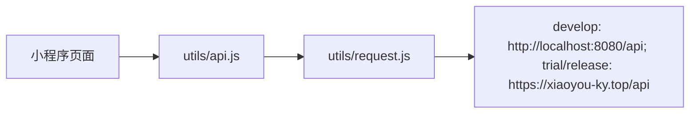
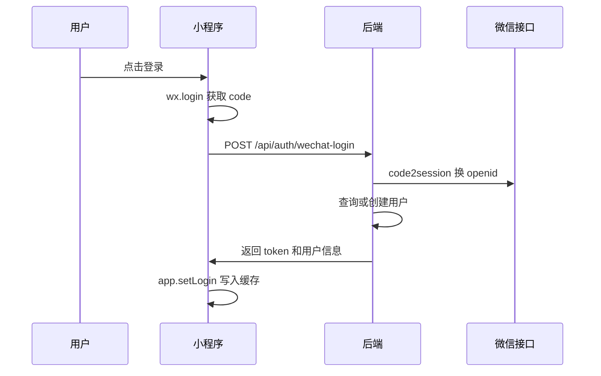

# 微信小程序说明

> 最后更新：2026-06-05

## 代码位置

小程序工程位于 `xiaochengxu`。

```text
xiaochengxu/
├── project.config.json
├── project.private.config.json
├── miniprogram/
│   ├── app.js
│   ├── app.json
│   ├── app.wxss
│   ├── pages/
│   ├── components/
│   ├── custom-tab-bar/
│   ├── utils/
│   └── images/
└── cloudfunctions/
    ├── api/
    └── quickstartFunctions/
```

## 当前主链路

当前小程序主链路通过 `miniprogram/utils/request.js` 直连 Spring Boot REST API。



`cloudfunctions/api` 中存在一套历史/可选云函数业务实现，包含 MySQL、JWT、AI 调用等重复逻辑。若后续继续采用直连 REST API，应考虑归档或删除云函数重复业务，避免双写维护。

## 全局配置

### `app.json`

注册页面：

- 首页：`pages/home/index`
- 主题：`pages/topics/index`
- 学习：`pages/learning/index`
- 我的：`pages/profile/index`
- 话题详情：`pages/topicDetail/index`
- 学习详情：`pages/learningTopic/index`
- AI 对话准备页：`pages/aiDialogSetup/index`
- AI 对话页：`pages/aiDialogChat/index`
- 单词本列表：`pages/wordBooks/index`
- 单词本详情：`pages/wordBookDetail/index`
- 单词练习：`pages/wordPractice/index`
- 单词详情：`pages/wordDetail/index`
- 每日外刊列表：`pages/dailyArticles/index`
- 每日外刊详情：`pages/dailyArticleDetail/index`
- 口语热身主题列表：`pages/spokenWarmup/index`
- 口语热身详情：`pages/spokenWarmupDetail/index`
- 登录：`pages/login/index`
- 注册：`pages/register/index`
- 设置：`pages/settings/index`
- 兑换：`pages/redeem/index`
- 日历：`pages/calendar/index`

底部 tab：

- 首页
- 主题
- 学习
- 我的

### `app.js`

全局状态：

- `token`
- `isLoggedIn`
- `role`
- `membershipActive`
- `membershipExpireAt`
- `hasPassword`
- `userInfo`
- `baseUrl`

环境 API 地址：

- `develop` 配置为 `http://localhost:8080/api`，用于微信开发者工具本地联调。
- `trial`、`release` 配置为 `https://xiaoyou-ky.top/api`。
- 启动时通过 `wx.getAccountInfoSync()` 识别小程序环境并设置 `globalData.baseUrl`。

全局方法：

- `loadUserFromStorage()`：从本地缓存恢复登录态。
- `setLogin(token, userInfo)`：写入全局状态和本地缓存。
- `logout()`：清除登录态。
- `checkLogin()`：是否已登录。
- `isMember()`：管理员或会员。
- `isAdmin()`：是否管理员。

## 请求封装

### `utils/request.js`

统一封装 `wx.request`：

- 从 `app.globalData.baseUrl` 拼接请求地址。
- 自动附加 `Authorization: Bearer <token>`。
- 2xx 返回 `res.data`。
- 401 自动退出登录并跳转登录页。
- 403 仅作为权限不足返回调用页处理，不清除本地登录态；会员权限场景会引导到学习中心开通/兑换。
- 非 2xx 统一包装错误信息。

### `utils/api.js`

按业务封装接口方法：

- 认证：登录、注册、微信登录、改用户名、改密码、设置密码、PC 登录确认/取消。
- 话题：列表、详情、标签、统计、日历。
- 学习：主题详情、热身、词汇、表达、任务、点评。
- 口语热身：主题详情、热身介绍、核心词汇、句型模板、地道表达、模拟任务、AI 点评、真实语音转文字。
- 会员：会员状态、联系方式、卡密兑换。
- 单词练习：已发布单词本、单词本详情、下一词、单词详情、提交认识/模糊/不认识、进度。
- 每日外刊：未读/已读列表、外刊详情并自动标记已读。

## 页面说明

| 页面 | 文件 | 功能 |
| --- | --- | --- |
| 首页 | `pages/home/index` | 展示统计、最近主题、分类入口、学习入口 |
| 主题列表 | `pages/topics/index` | 标签筛选、关键词搜索、分页加载、跳转详情 |
| 话题详情 | `pages/topicDetail/index` | 展示主题、问题、会员学习入口 |
| 学习列表 | `pages/learning/index` | 会员学习入口、主题筛选、非会员开通提示 |
| 学习详情 | `pages/learningTopic/index` | AI 热身、词汇、表达、任务、回答点评 |
| AI 对话准备 | `pages/aiDialogSetup/index` | 登录用户选择教学/练习模式、初级/进阶难度、系统主题或自定义主题 |
| AI 对话 | `pages/aiDialogChat/index` | 当前页面内存中保持上下文，发送文字消息，播放 AI 音频，按需显示 AI 回复文字和教学点评 |
| 单词本列表 | `pages/wordBooks/index` | 展示已发布单词本、词数和个人进度 |
| 单词本详情 | `pages/wordBookDetail/index` | 初级/进阶切换、总词数、已学、待复习、已掌握和开始练习入口 |
| 单词练习 | `pages/wordPractice/index` | 先展示英文单词和美式/英式发音胶囊，用户选择认识/模糊/不认识；模糊和不认识会在当前页展开详情 |
| 单词详情 | `pages/wordDetail/index` | 使用与练习页一致的沉浸式渐变详情样式，展示释义、音标、词性、句型、例句、来源和发音入口 |
| 每日外刊列表 | `pages/dailyArticles/index` | 未读/已读 tab、下拉刷新、触底分页、跳转详情 |
| 每日外刊详情 | `pages/dailyArticleDetail/index` | 音频播放、英文段落、中文翻译开关、总结、重点词汇和表达句型 |
| 口语热身列表 | `pages/spokenWarmup/index` | 登录用户搜索、标签筛选、日期筛选系统主题并进入口语热身 |
| 口语热身详情 | `pages/spokenWarmupDetail/index` | 初级/进阶切换，按模块实时生成热身、词汇、句型、表达、任务，支持语音/文字回答和 AI 点评 |
| 登录 | `pages/login/index` | 微信登录，调用 `wx.login` 后传 code 到后端 |
| 注册 | `pages/register/index` | 用户名密码注册 |
| 我的 | `pages/profile/index` | 用户信息、会员状态、设置、兑换、PC 登录确认 |
| 设置 | `pages/settings/index` | 改用户名、改密码、微信用户首次设置密码、会员联系信息 |
| 兑换 | `pages/redeem/index` | 卡密兑换与会员状态刷新 |
| 日历 | `pages/calendar/index` | 按月份查看话题日期分布 |

## 每日外刊流程

小程序首页提供“每日外刊”入口；学习中心顶部不再展示独立入口卡片。

## 首页学习入口

小程序首页 `pages/home/index` 的学习入口采用一行四列 icon 排列，图标为浅色底、低饱和线性符号，延续当前 iOS / Apple 风格首页视觉：

- 单词练习：跳转 `pages/wordBooks/index`。
- AI 对话：跳转 `pages/aiDialogSetup/index`。
- 每日外刊：跳转 `pages/dailyArticles/index`。
- 口语热身：直接切换到底部 `pages/learning/index` 学习 tab。

单词练习、AI 对话、每日外刊在未登录时仍统一跳转登录页；口语热身入口直接切换到学习 tab，由学习页承接登录或会员状态展示。

权限：

- 未登录点击“口语热身”会直接进入学习 tab，并由学习页展示登录引导。
- 已登录用户可使用每日外刊，不限制会员状态。

列表页 `pages/dailyArticles/index`：

- 默认请求未读外刊。
- 支持未读/已读 tab 切换。
- 支持下拉刷新和触底分页。
- 展示英文标题、中文标题和更新日期。
- 点击列表项进入 `pages/dailyArticleDetail/index?id=<articleId>`。

详情页 `pages/dailyArticleDetail/index`：

- 调用详情接口后，后端自动把当前用户标记为已读。
- 顶部展示发布日期、英文标题、中文标题、播放音频按钮和中文翻译开关。
- 正文按段落展示英文；开启中文翻译后，在英文段落下方展示对应中文。
- 文章总结、重点词汇和表达句型为空时不展示。
- `vocabulary` 和 `expressions` 是 JSON 字符串，页面会解析失败兜底为空列表。

接口：

- `GET /api/daily-articles?read=false&page=0&size=10`：未读外刊列表。
- `GET /api/daily-articles?read=true&page=0&size=10`：已读外刊列表。
- `GET /api/daily-articles/{id}`：外刊详情，并自动标记当前用户已读。

音频：

- 音频 URL 可能是 `/uploads/daily-articles/...` 站点相对路径。
- 页面复用 `utils/audio.js`，播放前会用当前环境 API 地址去掉 `/api` 后补全为静态资源 URL。

## 组件说明

| 组件 | 文件 | 说明 |
| --- | --- | --- |
| 话题卡片 | `components/topic-card` | 展示主题卡片并跳转详情 |
| 加载状态 | `components/loading` | 通用 loading |
| 空状态 | `components/empty-state` | 通用 empty state |
| 会员弹窗 | `components/membership-modal` | 非会员开通/兑换提示 |
| 自定义 tabbar | `custom-tab-bar` | 首页、主题、学习、我的底部导航 |

## 登录流程

### 微信登录



### 首次设置密码

微信自动注册用户默认 `hasPassword=false`。用户可在设置页调用 `/auth/password/setup` 设置密码，之后可在 PC 端用账号密码登录。

## PC 扫码登录确认

小程序“我的”页包含 PC 登录确认逻辑。

流程：

1. PC 端生成二维码，内容包含 `xiaoyouyingyu://pc-login?ticket=...`。
2. 小程序识别 ticket。
3. 小程序调用 `/auth/wechat-pc-login/scene/{ticketId}` 获取设备信息。
4. 用户确认后调用 `/auth/wechat-pc-login/confirm`。
5. PC 端轮询 session 接口获取 token。

## 学习中心流程

小程序学习详情页 `pages/learningTopic/index` 与 PC 学习中心类似：

- 加载主题。
- 选择初级/进阶模式。
- 生成热身内容。
- 生成词汇。
- 生成表达。
- 生成任务。
- 用户输入回答。
- 调用 AI 点评。

接口需要会员权限。若后端返回无权限，小程序应引导登录、兑换或开通会员。

## 口语热身流程

小程序首页提供“口语热身”入口，替换原“听力练习”占位入口；当前入口会直接切换到学习 tab 页面。

权限：

- 未登录点击入口进入学习 tab，由学习页展示登录引导。
- 原口语热身列表和详情页面保留；首页“口语热身”入口不再直达列表页，而是进入学习 tab。

列表页 `pages/spokenWarmup/index`：

- 调用现有 `/api/topics` 分页加载系统主题。
- 支持关键词搜索、标签筛选、开始日期和结束日期筛选。
- 支持下拉刷新和触底分页。
- 点击主题进入 `pages/spokenWarmupDetail/index?id=<topicId>`。

详情页 `pages/spokenWarmupDetail/index`：

- 调用 `/api/spoken-warmup/topic/{id}` 获取主题。
- 默认难度为初级，可切换进阶。
- 每个模块点击时单独实时生成，不在进入页面时一次生成全部内容。
- 模块包括热身介绍、核心词汇、句型模板、地道表达、模拟问答。
- 每个模块支持重新生成，页面会把本次当前难度下最近生成批次作为 `exclude` 传给后端去重。
- 模拟问答默认语音输入，也可切换文字输入。
- 语音输入使用 `wx.getRecorderManager()` 录制真实音频，通过 `/api/spoken-warmup/speech-to-text` 上传并获取识别文本。
- 识别文本可编辑，提交后调用 `/api/spoken-warmup/review` 获取评分、优点、改进建议、纠错、优化回答和鼓励语。
- V1 只在当前页面内存缓存生成内容；退出页面后内容丢失，不保存录音和学习记录。

## AI 对话流程

小程序首页提供“AI 对话”入口；学习中心顶部不再展示独立入口卡片。

权限：

- 未登录点击入口跳转登录页。
- 已登录用户可使用 AI 对话，不限制会员状态。

准备页 `pages/aiDialogSetup/index`：

- 调用 `/api/ai-dialog/config` 获取启用状态、单次最大轮数、每日轮数限制和当天剩余额度。
- 支持教学/练习模式切换。
- 支持初级/进阶难度切换。
- 支持选择已有系统主题，也支持输入 100 字以内的自定义主题。
- “开始对话”主按钮位于页面顶部标题下方，已有主题默认仅展示最近 5 条，引导用户通过搜索定位更多主题。
- 页面视觉采用浅色 Apple 风格：顶部突出开始按钮，额度以两张轻量信息块展示，模式/难度/主题切换使用低视觉重量的扁平分段控件。

对话页 `pages/aiDialogChat/index`：

- 对话历史只保存在当前页面内存中，退出页面后清空。
- 每发送一条用户消息调用 `/api/ai-dialog/message`，成功后当天剩余额度减少 1。
- AI 回复默认隐藏正文，用户点击“显示文字”后展示。
- 教学模式展示中文点评、优化表达和解释；练习模式默认只展示英文对话内容。
- 如果后端返回 `audioUrl`，小程序会自动播放 AI 英文回复并支持重播；如果 TTS 生成失败，则降级为文字展示。
- 语音输入按钮已接入录音状态与权限反馈；后端 `/api/ai-dialog/speech-to-text` 复用真实 ASR 能力，可上传本次录音并返回识别文本。
- 底部输入栏默认是语音输入，一个输入区域内通过左侧系统风格图标在语音和文字输入间切换；语音录制结束后应展示可编辑识别文本后发送。

## 单词练习流程

小程序首页新增“单词练习”入口；学习中心顶部不再展示独立入口卡片。

流程：

1. 未登录用户点击入口跳转登录页。
2. 已登录用户进入 `pages/wordBooks/index` 后，可访问 `/api/word-practice/**` 接口。
3. 单词练习仅要求登录，不限制会员状态。
4. 登录用户可查看已发布单词本。
5. 用户进入单词本详情后选择初级或进阶。
6. 单词本详情页展示总词数、已学、待复习、已掌握和开始练习入口，不展示学习记录列表。
7. 练习页调用 `/api/word-practice/books/{bookId}/next`，后端优先返回到期复习词，没有到期复习词时返回未学新词。
8. 用户点击“认识”后提交 `KNOWN` 并进入下一词；点击“模糊”后提交 `FUZZY`，点击“不认识”后提交 `UNKNOWN`，并在当前单词下方直接展示释义、句型、例句、来源和发音入口。
9. 用户也可进入单词详情页查看释义、句型、例句和带语音图标的“美式发音/英式发音”入口。

### 单词详情视觉样式

`pages/wordPractice/index` 和 `pages/wordDetail/index` 的单词详情采用统一视觉语言：

- 背景使用与 AI 对话模块一致的浅色 Apple 风格竖向渐变，主操作强调色继续沿用全局主题色 `--primary`（`#007AFF`）。
- 顶部突出英文单词大标题，音标与美式/英式发音入口合并为胶囊按钮。
- 单词本列表使用轻量白色卡片、扁平分段控件、低饱和进度信息块。
- 释义、例句、搭配/来源使用浅色内容卡片，弱化传统重边框。
- 练习页和详情页底部固定展示“认识 / 模糊 / 不认识”三段操作，分别提交 `KNOWN` / `FUZZY` / `UNKNOWN`。
- 练习页答错或选择模糊/不认识后，会在单词卡下方展开释义、例句和来源信息，底部操作区保留主操作位置。

单词和例句音频由后端按单词本维度保存到 `/uploads/word-audio/{wordBookId}/{wordId}/`。接口可能返回 `/uploads/...` 形式的站点相对路径，小程序播放前会用当前环境 API 地址去掉 `/api` 后补全为可访问的静态资源 URL；若音频不存在或生成失败，页面会提示“暂无音频”或“音频播放失败”。

## 会员与卡密

小程序中会员入口分布在：

- `pages/profile/index`
- `pages/settings/index`
- `pages/redeem/index`
- `components/membership-modal`
- `pages/learning/index`
- `pages/topicDetail/index`

主要行为：

- 查询会员状态。
- 展示到期时间。
- 非会员查看联系方式。
- 输入卡密兑换。
- 兑换成功后刷新全局会员状态。

## 静态资源

小程序图标资源位于：

- `images/tabbar`
- `images/tag-icons`
- `images/category-icons`

## 云函数说明

### `cloudfunctions/api`

包含一套 Node.js 云函数 API，使用：

- `wx-server-sdk`
- `mysql2/promise`
- `jsonwebtoken`
- `bcryptjs`
- `node-fetch`

该云函数内部实现了认证、主题、学习、会员等 action 分发，与后端 REST API 功能重叠。

维护建议：

- 如果生产小程序继续直连 Spring Boot，应停止维护云函数业务实现，只保留必要的微信云能力。
- 如果决定改回云函数，则需要让小程序 `utils/api.js` 改为 `wx.cloud.callFunction`，并同步云函数与后端的数据模型、JWT 密钥和会员规则。

### `cloudfunctions/quickstartFunctions`

微信云开发 quickstart 示例函数，不属于核心业务链路。

## 维护建议

- `app.js` 中 API 域名建议按 develop/trial/release 区分，开发环境可指向测试后端。
- 微信登录依赖后端 `wechat.appid` 和 `wechat.secret`，上线前需确认与小程序 AppID 一致。
- 小程序端不要保存敏感密钥，所有密钥应仅在后端或云函数中使用。
- 学习详情页的 AI 返回 JSON 建议增加解析容错与重试提示。
