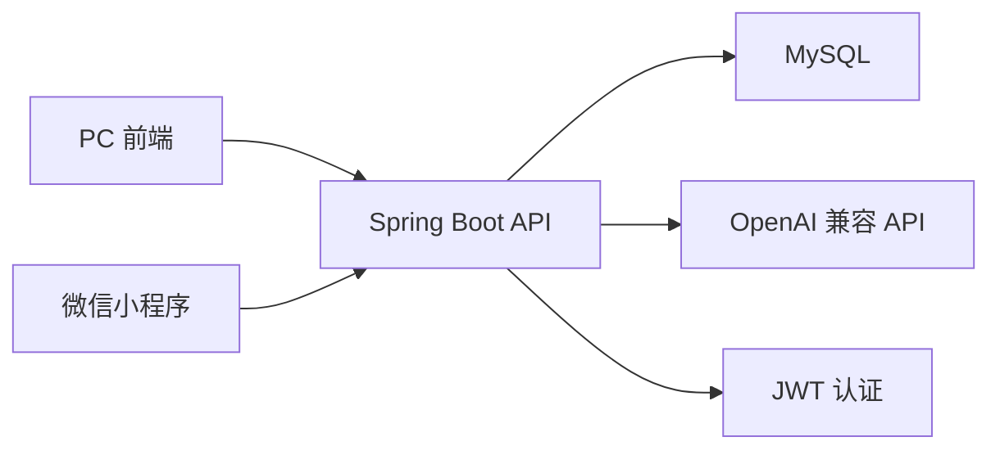

# 仓库总览

> 最后更新：2026-05-25

## 项目定位

小柚英语面向英语口语练习场景，围绕“每日/按主题练习”组织内容。系统支持管理员创建或用 AI 生成口语主题，普通用户浏览主题，会员用户进入学习中心完成热身、词汇、表达、练习任务和 AI 点评。

## 子系统

| 子系统 | 目录 | 说明 |
| --- | --- | --- |
| 后端服务 | `src/main/java/com/xiaoyouyingyu` | Spring Boot REST API，负责认证、话题、学习、会员、管理后台等能力 |
| PC 前端 | `frontend` | Next.js 管理与学习 Web 应用 |
| 微信小程序 | `xiaochengxu/miniprogram` | 原生微信小程序，提供移动端浏览、学习、登录、会员兑换 |
| 小程序云函数 | `xiaochengxu/cloudfunctions` | 历史/可选云函数代码，目前小程序主链路通过 REST API 访问后端 |
| 文档 | `doc` | 仓库说明、部署说明、PRD 归档 |

## 技术栈

| 层 | 技术 |
| --- | --- |
| 后端 | Java 21、Spring Boot 3.2.5、Spring Security、Spring Data JPA、MySQL、JJWT、Lombok |
| PC 前端 | Next.js 14、React 18、TypeScript、Tailwind CSS、TanStack React Query、Radix UI、Lucide React |
| 小程序 | 微信原生小程序 WXML/WXSS/JS、微信登录、微信云函数 SDK |
| AI | OpenAI 兼容 Chat Completions API，可通过后台模型配置切换供应商和模型 |

## 顶层目录

```text
xiaoyouyingyu2/
├── pom.xml
├── src/
│   └── main/
│       ├── java/com/xiaoyouyingyu/
│       └── resources/
├── frontend/
│   ├── package.json
│   └── src/
├── xiaochengxu/
│   ├── miniprogram/
│   └── cloudfunctions/
├── doc/
│   ├── prd/
│   └── *.md
├── DEVELOPMENT.md
└── CLAUDE.md
```

## 核心业务能力

### 用户与认证

- 账号密码注册、登录。
- 微信小程序登录：使用微信 code 换取 openid，自动创建或复用用户。
- PC 微信扫码登录：PC 端生成短期 ticket，小程序扫码/识别后确认登录，PC 端轮询完成登录。
- JWT 无状态认证，客户端通过 `Authorization: Bearer <token>` 访问受保护接口。

### 话题管理

- 话题包含英文标题、中文标题、分类标签、日期、讨论问题 JSON。
- 游客可浏览基础话题信息；登录用户可搜索和查看完整内容。
- 管理员可创建、编辑、删除话题。
- 支持固定分类标签，后端会对标签进行合法性校验和顺序归一化。

### 学习中心

- 会员/管理员可访问学习中心。
- 围绕单个主题生成：
  - 主题理解与热身
  - 主题词汇
  - 表达模板
  - 练习任务
  - 用户回答 AI 点评
- 支持初级/进阶模式，前端和小程序都会按模式展示中文辅助或高阶表达。

### 会员与卡密

- 新用户注册自动赠送 3 天会员。
- 管理员可生成卡密、禁用卡密、给用户设置会员到期时间或追加天数。
- 用户可兑换卡密，系统记录会员变更流水。
- 管理员天然视为会员。

### AI 内容生成

- 管理后台可配置 AI 模型，包括 API 地址、Key、模型名和默认模型。
- 管理员可通过 AI 批量生成主题标题，再选择标题生成讨论问题，最后保存成话题。
- 学习中心 AI 内容同样使用后端 `AiService` 统一调用。

## 主要调用链



## 权限分层

| 角色/状态 | 能力 |
| --- | --- |
| 游客 | 浏览话题列表、标签、统计、日历、话题详情基础信息 |
| 登录用户 | 搜索话题、修改账号信息、查看会员状态、兑换卡密 |
| 会员用户 | 进入学习中心，调用 AI 学习内容接口 |
| 管理员 | 话题管理、用户管理、AI 模型管理、卡密管理、会员管理 |

## 维护提醒

- `src/main/resources/application.yml` 和小程序云函数中存在真实连接信息/密钥的历史写法，生产环境应改为环境变量或密钥管理服务。
- `schema.sql` 更像早期初始化脚本，当前表结构应优先以 JPA 实体为准。
- 小程序当前主链路使用 `miniprogram/utils/request.js` 直连 REST API；`cloudfunctions/api` 中有重复业务实现，后续应明确保留或清理。

